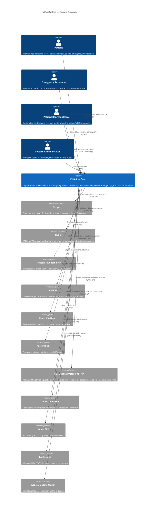
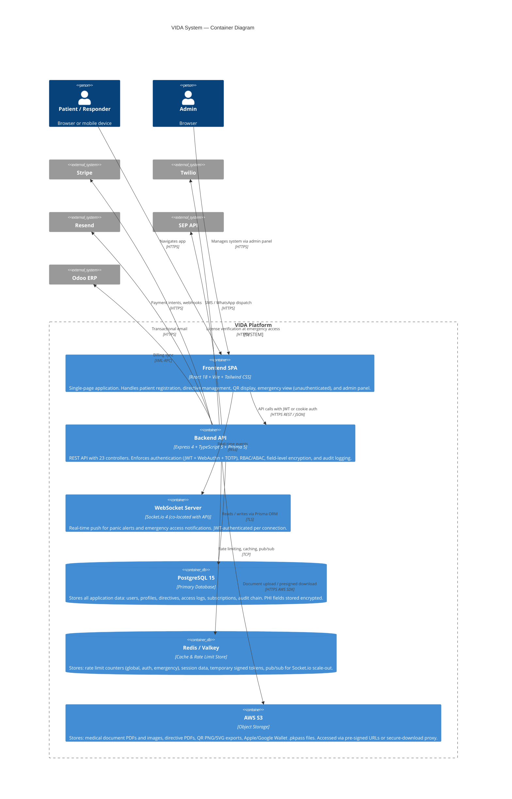
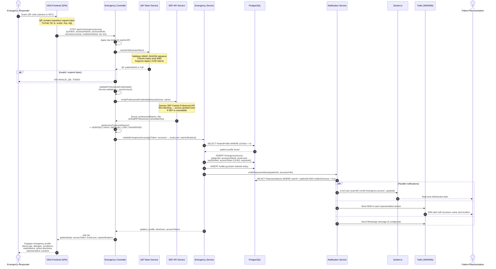
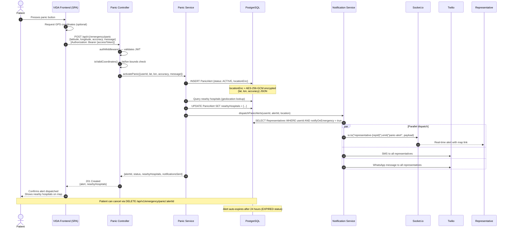
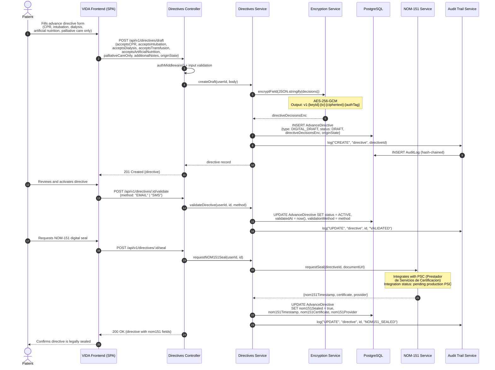
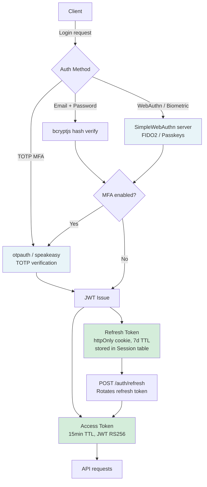

# VIDA System — Architecture Documentation

**Vinculacion de Informacion para Decisiones y Alertas**
Sistema de Directivas Medicas de Emergencia (Mexico)

Version: 1.0 | Date: 2026-03-04 | Status: Production

---

## Table of Contents

1. [System Overview](#1-system-overview)
2. [C4 Context Diagram](#2-c4-context-diagram)
3. [C4 Container Diagram](#3-c4-container-diagram)
4. [C4 Component Diagram — Backend API](#4-c4-component-diagram--backend-api)
5. [Data Flow Diagrams](#5-data-flow-diagrams)
6. [Security Architecture](#6-security-architecture)
7. [Compliance Matrix](#7-compliance-matrix)
8. [Technology Stack](#8-technology-stack)

---

## 1. System Overview

VIDA (Vinculacion de Informacion para Decisiones y Alertas) is a Mexican digital health platform that enables patients to store advance medical directives, emergency medical information, and emergency contacts in a secure, legally-compliant digital vault. During a medical emergency, first responders and healthcare professionals scan the patient's unique QR code to instantly access critical — and potentially life-saving — information.

### Core Use Cases

| Actor | Primary Scenario |
|---|---|
| Patient | Registers account, stores medical profile (PUP), creates advance directives (Voluntad Anticipada), designates representatives, downloads QR code |
| Emergency Responder | Scans QR code at scene, provides professional credentials (verified against SEP), receives immediate access to allergies, conditions, medications, directives |
| Representative | Receives real-time WebSocket + SMS/WhatsApp notification when patient QR is scanned |
| Admin | Manages users, institutions, subscriptions, audits system access |

### Key Design Principles

- **Privacy by Design**: All PHI (Protected Health Information) is field-level encrypted with AES-256-GCM. Emergency access exposes only pre-consented, categorized data.
- **Zero Trust for Emergency Access**: Even the QR code reveals no PHI — it contains only an HMAC-signed token that resolves to the patient at scan time.
- **Auditability**: Every data access generates an immutable hash-chained audit log entry (NOM-024 compliant).
- **Legal Compliance**: LFPDPPP (Mexican Privacy Law), NOM-004-SSA3-2012, NOM-024-SSA3-2012, NOM-151 (digital signature).
- **Availability in Emergency**: The emergency endpoint `/api/v1/emergency/access` requires no patient authentication — the signed QR token is the credential.

---

## 2. C4 Context Diagram

This diagram shows VIDA as a black box with all external actors and systems it interacts with.



---

## 3. C4 Container Diagram

This diagram decomposes VIDA into its deployable containers and their interactions.



---

## 4. C4 Component Diagram — Backend API

This diagram shows the internal modules of the Backend API container.

```mermaid
C4Component
    title VIDA Backend API — Component Diagram

    Container_Boundary(api_boundary, "Backend API (Express + TypeScript)") {

        Component(auth_mod, "Auth Module", "auth.controller + webauthn.controller + mfa.controller", "Handles registration, login, JWT issuance (access + refresh tokens via httpOnly cookie), WebAuthn biometric authentication, TOTP/MFA setup and verification, password reset.")

        Component(emergency_mod, "Emergency Module", "emergency.controller + emergency.service + qr-token.service", "Public QR scan endpoint (no patient auth required). Validates signed QR token (HMAC-SHA256), verifies accessor credentials against SEP, creates timed EmergencyAccess record, notifies representatives. Rate-limited: 10 req/min/IP.")

        Component(pup_mod, "Profile Module (PUP)", "pup.controller + pup.service", "Patient Unified Profile — stores blood type, allergies, conditions, medications, insurance data, photo, organ donor preferences. All PHI fields stored with field-level AES-256-GCM encryption.")

        Component(directives_mod, "Directives Module", "directives.controller + directives.service", "Advance medical directives (Voluntad Anticipada). Supports NOTARIZED_DOCUMENT upload, DIGITAL_DRAFT creation, and DIGITAL_WITNESSED (Phase 2). Manages lifecycle: DRAFT -> ACTIVE -> REVOKED. Integrates NOM-151 digital seal request.")

        Component(panic_mod, "Panic Module", "panic.controller + panic.service", "Emergency panic alert with optional GPS coordinates. Notifies representatives via SMS, WhatsApp, and WebSocket. Records nearby hospitals. Authenticated patients only.")

        Component(fhir_mod, "FHIR Module", "fhir-mapper.service + fhir-types", "HL7 FHIR R4 resource mapping: Patient, Consent (advance directive), AllergyIntolerance, Condition, MedicationStatement, AuditEvent. Enables NOM-024 interoperability with hospital systems.")

        Component(rbac_mod, "RBAC / ABAC Module", "rbac.service + admin-rbac.controller", "Role-Based Access Control (PATIENT, DOCTOR, NURSE, EMERGENCY, ADMIN, AUDITOR) combined with Attribute-Based checks (resource ownership, subscription tier). Roles stored in PostgreSQL with many-to-many Role-Permission model.")

        Component(notification_mod, "Notification Module", "email.service + twilio (SMS/WhatsApp) + socket-manager", "Multi-channel dispatch: Email (Resend + Nodemailer), SMS (Twilio), WhatsApp (Twilio), WebSocket push (Socket.io). Records all sends in Notification table with delivery status tracking.")

        Component(legal_mod, "Legal / Privacy Module", "consent.controller + arco.controller + legal.controller", "LFPDPPP compliance: privacy notice versioning, granular consent tracking, ARCO rights requests (Access, Rectification, Cancellation, Opposition) with 20-business-day SLA tracking.")

        Component(payment_mod, "Payment Module", "payments.controller + payments-webhook.controller + payments-admin.controller", "Stripe subscription management (monthly/annual, card and OXXO). Webhook handler for subscription lifecycle events. CFDI electronic invoice generation via Facturama.")

        Component(document_mod, "Document Module", "documents.controller + secure-download.controller", "Medical document upload to S3 (PDF, images). Secure download via time-limited signed tokens — no unauthenticated static file serving. Tracks all download events in DocumentAccessLog.")

        Component(wallet_mod, "Wallet Module", "wallet.controller", "Generates Apple Wallet (.pkpass) and Google Wallet passes containing the patient's QR code. Tracks QR download events per user with plan-based rate limits.")

        Component(hospital_mod, "Hospital Module", "hospital.controller", "CLUES-indexed medical institution registry. Supports emergency proximity lookup. OAuth credentials for institutional PAE (Patient Access via Emergency) integration.")

        Component(admin_mod, "Admin Module", "admin.controller + admin-auth.controller", "System administration: user management, institution management, subscription overview, system health metrics. Separate AdminUser model with TOTP MFA and session isolation.")

        Component(audit_svc, "Audit Trail Service", "audit-trail.service + audit-retention.service", "INSERT-only audit log with hash chain (previousHash -> currentHash via SHA-256). Supports NOM-024 immutability requirement. Automated retention policy runs at 03:00 AM daily, archives to S3 and purges per NOM-004 5-year rule.")

        Component(encryption_svc, "Encryption Service", "encryption-v2.service + key-management.service + document-encryption.service", "AES-256-GCM field-level encryption. Format: v1:{keyId}:{iv}:{ciphertext}:{authTag}. Envelope encryption (KEK/DEK) per user. HMAC-SHA256 blind indexes for searchable encrypted fields. HKDF-derived separate blind index key.")

        Component(middleware_layer, "Security Middleware", "csrf.middleware + auth.middleware + rbac guards", "Helmet CSP, HSTS, CORS, CSRF (Origin/Referer validation), JWT auth guard, optional auth guard for emergency view, rate limiters (Redis-backed), request logger with requestId.")
    }

    Rel(auth_mod, encryption_svc, "Encrypts sensitive user fields on write")
    Rel(pup_mod, encryption_svc, "Encrypts all PHI fields (allergies, conditions, medications)")
    Rel(directives_mod, encryption_svc, "Encrypts directiveDecisionsEnc JSON")
    Rel(emergency_mod, audit_svc, "Writes EmergencyAccess audit record")
    Rel(emergency_mod, notification_mod, "Triggers representative notifications")
    Rel(panic_mod, notification_mod, "Triggers multi-channel panic alerts")
    Rel(panic_mod, audit_svc, "Records panic activation in audit log")
    Rel(directives_mod, fhir_mod, "Maps directives to FHIR Consent resource")
    Rel(rbac_mod, middleware_layer, "Enforces permission checks on protected routes")
    Rel(payment_mod, audit_svc, "Audits subscription and payment events")
    Rel(document_mod, encryption_svc, "Encrypts document metadata")
    Rel(legal_mod, audit_svc, "Logs ARCO request lifecycle")
```



---

## 5. Data Flow Diagrams

### 5.1 Emergency QR Access Flow

This is the highest-priority flow in VIDA — it must succeed in a real medical emergency with minimal latency.



### 5.2 Panic Alert Flow



### 5.3 Directive Creation and NOM-151 Sealing Flow



---

## 6. Security Architecture

### 6.1 Encryption Model

VIDA uses a multi-layer encryption model to protect PHI at rest.

```
Master Key (KEK — Key Encryption Key)
    |
    +--> HKDF-SHA256 --> Blind Index Key (for HMAC-SHA256 searchable indexes)
    |
    +--> Envelope: per-user DEK (Data Encryption Key) encrypted with KEK
              |
              +--> Field encryption for each user's PHI fields

Field ciphertext format (V2):
    v1:{keyId}:{iv_hex}:{ciphertext_hex}:{authTag_hex}

    - Algorithm: AES-256-GCM
    - IV: 16 bytes (random per encrypt call)
    - Auth tag: 16 bytes (GCM integrity verification)
    - keyId: references which KEK version was used (enables key rotation)
```

**Encrypted fields in the database:**

| Model | Plaintext Field | Encrypted Field |
|---|---|---|
| User | name, phone, curp, dateOfBirth, address | nameEnc, phoneEnc, curpEnc, dateOfBirthEnc, addressEnc |
| User | email, curp | emailBlindIndex, curpBlindIndex (HMAC-SHA256) |
| PatientProfile | allergies, conditions, medications, bloodType, insurancePolicy | allergiesEnc, conditionsEnc, medicationsEnc, bloodTypeEnc, insurancePolicyEnc |
| PatientProfile | donorPreferences | donorPreferencesEnc |
| AdvanceDirective | all boolean decisions + notes | directiveDecisionsEnc (full JSON) |
| Representative | name, phone, email | nameEnc, phoneEnc, emailEnc |
| PanicAlert | latitude, longitude, accuracy | locationEnc |
| User | TOTP secret | totpSecret (AES-256-GCM) |
| AdminUser | TOTP MFA secret | mfaSecret (AES-256-GCM) |

### 6.2 QR Token Security

The QR code printed by the patient contains no PHI. It encodes a signed token:

```
Token structure (base64url encoded JSON):
{
  "id":    "uuid-referencing-patientProfile.qrToken",
  "ts":    1709500000,           // Unix timestamp of generation
  "scope": "emergency",          // Access scope
  "exp":   1741036000,           // Expiry (default: 1 year)
  "sig":   "hmac-sha256-hex"     // HMAC-SHA256(id + ts + scope, QR_TOKEN_SECRET)
}

Security properties:
- Signature prevents token forgery
- exp field enforces token rotation
- Legacy UUID tokens (no signature) are also accepted for backward compatibility
- Rate limiting (10 req/min/IP) prevents brute-force token enumeration
- Artificial response delay (200ms minimum) prevents timing attacks on failed lookups
- Failed attempt tracking alerts on 5+ failures from same IP
```

### 6.3 Authentication Architecture



### 6.4 Access Control Model

VIDA uses a combined RBAC + ABAC model:

**Roles (RBAC):**

| Role | Description | Key Permissions |
|---|---|---|
| PATIENT | Registered patient | read/write own profile, directives, representatives |
| DOCTOR | Verified physician | read patient data (with consent or emergency access) |
| NURSE | Verified nurse | limited read patient data |
| EMERGENCY | Emergency responder | QR-based emergency access (time-limited, audited) |
| ADMIN | System administrator | full user and institution management |
| AUDITOR | Read-only audit access | read audit logs, metrics |

**Attribute-Based checks (ABAC):**
- Resource ownership: a patient can only read/write their own records (`userId === req.userId`)
- Subscription tier: QR download limits, representative count limits based on plan
- Time-based: EmergencyAccess records have `expiresAt` enforced at the service layer
- Break-the-glass: Emergency access bypasses normal auth but creates a mandatory, immutable audit entry

### 6.5 Emergency Break-the-Glass Access

The emergency endpoint is intentionally public (no patient JWT required) to function in real emergencies. The security model relies on:

1. **Signed QR token** — forgery-resistant (HMAC-SHA256)
2. **SEP credential verification** — accessor's medical license verified against the national registry
3. **Trust level scoring** — VERIFIED / HIGH / MEDIUM / LOW / UNVERIFIED based on SEP result and role type
4. **Mandatory audit** — every access creates an immutable `EmergencyAccess` record and `AuditLog` hash-chain entry
5. **Representative notification** — patient's designated contacts are notified immediately via WebSocket + SMS + WhatsApp
6. **Timed session** — `EmergencyAccess.expiresAt` is set to 60 minutes from access time
7. **Rate limiting** — 10 attempts/minute/IP with failed attempt tracking and security alerts at 5+ failures

### 6.6 Security Middleware Stack

All requests pass through the following middleware chain (in order):

```
1. Trust proxy (Coolify/Caddy reverse proxy)
2. Helmet (CSP, HSTS 1yr + includeSubDomains + preload, X-Frame-Options: DENY)
3. CORS (explicit origin allowlist)
4. Additional security headers (X-Content-Type-Options, etc.)
5. CSRF protection (Origin / Referer header validation)
6. Cookie parser (httpOnly refresh tokens)
7. Compression (gzip)
8. Morgan request logger
9. Structured request logger (requestId per request)
10. Global rate limiter (Redis-backed, configurable per environment)
11. Auth-specific rate limiter (50 req/15min in production)
12. Emergency-specific rate limiter (10 req/min/IP)
```

### 6.7 Audit Trail Integrity

The `AuditLog` table implements a cryptographic hash chain to guarantee immutability:

```
AuditLog record N:
  currentHash = SHA-256(id + action + resource + details + previousHash + createdAt)
  previousHash = currentHash of record N-1 (null for genesis record)
  sequence = monotonically increasing integer (unique constraint)

Verification: re-computing currentHash from stored fields must match stored value.
Any tampering with a record breaks the hash chain for all subsequent records.
```

This design satisfies NOM-024-SSA3-2012 requirements for electronic clinical record integrity.

---

## 7. Compliance Matrix

| Regulation | Requirement | VIDA Implementation | Status |
|---|---|---|---|
| **LFPDPPP Art. 8-9** | Explicit consent before data processing | `ConsentRecord` model tracks consent per `PrivacyPolicyVersion` with scope array | Implemented |
| **LFPDPPP Art. 16** | Privacy notice (Aviso de Privacidad) | `/aviso-privacidad` public route + versioned `PrivacyPolicyVersion` table | Implemented |
| **LFPDPPP Art. 19** | Security measures (encryption) | AES-256-GCM field-level encryption on all PHI fields | Implemented |
| **LFPDPPP Art. 28-35** | ARCO rights (Acceso, Rectificacion, Cancelacion, Oposicion) | `ARCORequest` model with unique folio, 20-business-day `dueDate`, status lifecycle | Implemented |
| **LFPDPPP Art. 36** | Data breach notification to INAI | Security alerts service + admin notification channel | Partial |
| **NOM-004-SSA3-2012** | Medical record 5-year retention | `auditRetentionService` runs nightly; archives to S3, purges after retention period; `DocumentCategory.EMERGENCY_PROFILE` explicitly noted as not constituting an expediente clinico | Implemented |
| **NOM-024-SSA3-2012** | Electronic clinical record interoperability | FHIR R4 mapper (Patient, Consent, AllergyIntolerance, Condition, MedicationStatement, AuditEvent) | Implemented |
| **NOM-024-SSA3-2012** | Audit trail immutability | Hash-chained `AuditLog` (SHA-256 previousHash -> currentHash chain, unique sequence number) | Implemented |
| **NOM-151-SCFI-2016** | Digital document timestamp / certification | `nom151.service` + `AdvanceDirective.nom151Sealed/nom151Timestamp/nom151Certificate` fields; PSC (Prestador de Servicios de Certificacion) integration | Partial (PSC integration pending) |
| **SEP / Cedulas Profesionales** | Verification of health professional credentials | `cedula-sep.service` queries SEP API at every emergency access; result stored in `EmergencyAccess.sepVerified` and trust level | Implemented |
| **INAI / Data Minimization** | Collect only data necessary for purpose | Emergency view exposes only pre-consented categories: allergies, conditions, medications, directives, emergency contacts | Implemented |

---

## 8. Technology Stack

### Frontend

| Category | Technology | Version | Purpose |
|---|---|---|---|
| Framework | React | 18.2 | UI component library and rendering |
| Build Tool | Vite | 5.0 | Fast development server and bundler |
| Language | TypeScript | 5.2 | Static typing |
| Styling | Tailwind CSS | 3.3 | Utility-first CSS framework |
| Routing | React Router | 6.20 | Client-side SPA routing |
| Forms | React Hook Form + Zod | 7.48 / 3.22 | Form state management and validation |
| Data Fetching | TanStack React Query | 5.8 | Server state, caching, optimistic updates |
| HTTP Client | Axios | 1.6 | REST API communication |
| Real-time | Socket.io Client | 4.8 | WebSocket connection for push notifications |
| Maps | Leaflet + React Leaflet | 1.9 / 4.2 | Geolocation map display for panic alerts |
| QR Code | qrcode.react | 3.1 | QR code rendering in browser |
| WebAuthn | @simplewebauthn/browser | 13.2 | Biometric / passkey authentication |
| i18n | i18next + react-i18next | 25.8 | Internationalization (ES/EN) |
| Sanitization | DOMPurify | 3.3 | XSS prevention for user-supplied HTML |
| Testing | Vitest + Testing Library | 4.0 | Unit and component tests |
| E2E Testing | Playwright | 1.58 | End-to-end browser automation |

### Backend

| Category | Technology | Version | Purpose |
|---|---|---|---|
| Runtime | Node.js | >=18.0 | JavaScript runtime |
| Framework | Express | 4.18 | HTTP server and middleware |
| Language | TypeScript | 5.3 | Static typing |
| ORM | Prisma | 5.22 | Type-safe database access and migrations |
| Database | PostgreSQL | 15 | Primary relational data store |
| Cache | Redis / Valkey | (ioredis 5.3) | Rate limiting, session cache |
| Real-time | Socket.io | 4.8 | WebSocket server for push notifications |
| Authentication | jsonwebtoken (9.0) | 9.0 | JWT access + refresh tokens |
| WebAuthn | @simplewebauthn/server | 13.2 | FIDO2 / passkey server-side verification |
| TOTP MFA | otpauth + speakeasy | 9.5 / 2.0 | Time-based one-time passwords |
| Encryption | Node.js crypto (built-in) | — | AES-256-GCM, HMAC-SHA256, HKDF |
| Object Storage | AWS SDK v3 (S3) | 3.600 | Medical document storage |
| Email | Resend + Nodemailer | 6.6 | Transactional email |
| SMS / WhatsApp | Twilio | 4.19 | Emergency SMS and WhatsApp alerts |
| Payments | Stripe | 20.1 | Subscription billing (card + OXXO) |
| PDF Generation | Puppeteer | 24.15 | Server-side PDF rendering for directives |
| QR Generation | qrcode | 1.5 | QR code image generation |
| Wallet Passes | passkit-generator | 3.5 | Apple Wallet .pkpass generation |
| Logging | Winston | 3.11 | Structured JSON logs |
| Security | Helmet | 7.1 | Security headers |
| Rate Limiting | express-rate-limit | 7.1 | Redis-backed per-route rate limiting |
| Validation | express-validator + Zod | 7.0 / 3.22 | Input validation and schema enforcement |
| i18n | i18next | 25.8 | API error message internationalization (ES/EN) |
| ERP Integration | xmlrpc | 1.3 | Odoo XML-RPC billing sync |
| Testing | Vitest + Jest + Supertest | 4.0 / 29.7 | Unit, integration tests |

### Infrastructure

| Component | Technology | Notes |
|---|---|---|
| Hosting | Coolify (self-hosted PaaS) | Orchestrates containers on VPS |
| Reverse Proxy | Caddy | TLS termination, HTTPS redirect |
| Database | PostgreSQL 15 | Primary data store |
| Cache | Redis / Valkey | Rate limiting and session cache |
| Object Storage | AWS S3 | Documents and QR exports |
| CI/CD | Git-based deploy via Coolify | Automated build and deploy on push |
| Containers | Docker + docker-compose | Local dev and production |

---

*This document was generated from source code analysis of the VIDA system codebase.*
*Key source files: `backend/src/main.ts`, `backend/prisma/schema.prisma`, `frontend/src/App.tsx`*
*Last updated: 2026-03-04*
